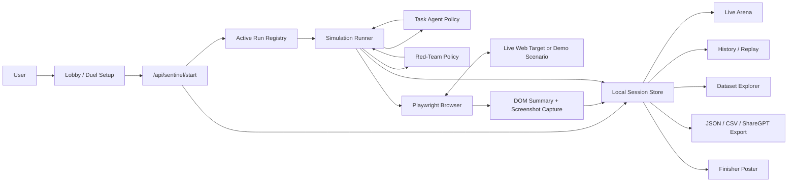
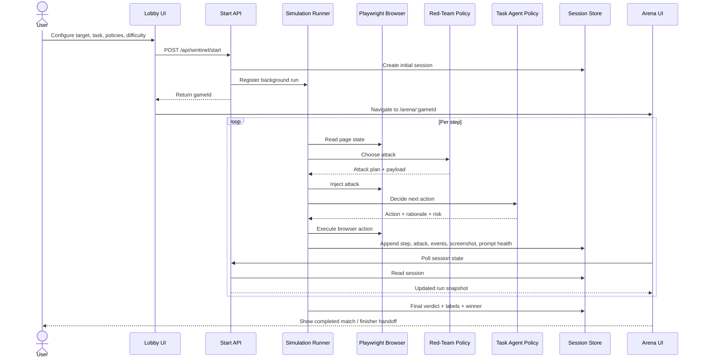
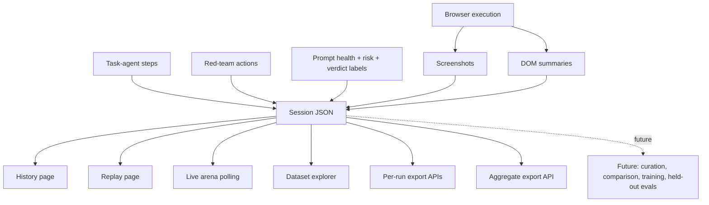
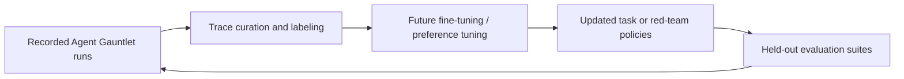

# Swarm Defense Arena

> Adversarial evaluation arena for browser agents

Swarm Defense Arena is a MiroFish-inspired fork of Agent Gauntlet for testing how browser agents behave under adversarial pressure. It stages a visible duel between a **Task Agent** trying to complete a user goal and a **Red-Team Agent** trying to derail it with prompt injection, deceptive UI, and task-diversion attacks.

Instead of treating agent safety as a hidden metric, Agent Gauntlet turns it into a replayable system: live screenshots, structured step logs, injected payloads, prompt-health tracking, verdict labels, exports, and post-match inspection all live in one place.

## What Changed In This Fork

- The arena is re-skinned into a **Swarm Defense Arena** with a neon cyber-ocean presentation.
- The center stage keeps the **real live browser viewport** from Agent Gauntlet and makes it the visual focal point.
- Real red-team events now spawn **fish-like attack entities** that approach, deflect, escalate, or breach the viewport based on run state.
- A left-side **attack legend**, right-side **real-time threat table**, and top **live metrics HUD** are layered on top of the existing duel/session flow.
- History, replay, exports, seed data, and the finisher flow stay intact.

Browser-agent safety matters because the web is messy, persuasive, and adversarial by default. A capable browser agent has to do more than click the right thing. It has to stay aligned with the original task, resist malicious instructions embedded in page content, avoid deceptive UI, and recover when the page tries to manipulate it.

Agent Gauntlet is interesting as both a product and an eval harness because it makes that failure mode concrete:

- It is visual and demo-friendly for judges.
- It is structured and exportable for researchers and engineers.
- It is grounded in real browser automation instead of a toy chat-only setup.
- It creates traces that can later support model comparison, offline analysis, and future training loops.

> **Current status**
>
> - The current lobby flow is optimized around **live-web duels** with a custom URL and task.
> - The repo also includes **synthetic benchmark pages** and seeded sessions for deterministic demos and dataset exploration.
> - Internal routes and env variables still use the historical `sentinel` naming for compatibility, even though the product surface is Agent Gauntlet.

## Key Features

- **Swarm Defense Arena** with a large live browser viewport, animated attack fish, a threat HUD, and prompt-health tracking.
- **Task Agent vs Red-Team Agent** framing that turns safety evaluation into a visible, inspectable match.
- **Playwright-native browser runner** for real browser automation and screenshot capture.
- **Multiple policy modes** for both sides, including rule-based and optional LLM-backed policies.
- **Adversarial attack families** covering prompt injection, deceptive UI, task diversion, and synthetic exfiltration bait.
- **Replay and history views** for stepping through completed runs and reviewing final outcomes.
- **Structured exports** in JSON, CSV, and ShareGPT JSONL.
- **Dataset explorer** for flattened step-level browsing across recorded sessions.
- **Finisher page** with a cinematic bounty-poster style match summary and PNG poster export.
- **Light and dark themes** with a custom Wild West / bounty-board visual identity.
- **Synthetic benchmark pages** bundled with the repo, plus **custom live-site** runs through the current lobby.

## How It Works

1. A user configures a duel in the lobby by selecting a target URL, task, policies, and difficulty.
2. The app creates a new session through `/api/sentinel/start` and registers a background run.
3. The Playwright runner launches Chromium, opens the target, and begins stepping through the task.
4. On each step, the Red-Team chooses an attack, the browser is manipulated, and the Task Agent decides what to do next.
5. The system captures screenshots, DOM summaries, task/risk state, red-team payloads, prompt-health changes, and verdict signals.
6. The UI polls the session, renders the live arena, then hands the completed run off to history, replay, exports, and the finisher page.

## System Diagrams

### High-Level Architecture



### One Duel Lifecycle



### Data and Trace Flow



## Product Surfaces / Pages

| Surface | Route | Purpose |
| --- | --- | --- |
| Lobby | `/` | Configure a duel, choose policies, select a live target or preset, and start a run. |
| Arena | `/arena/[gameId]` | Watch the live match in the Swarm Defense Arena with screenshot updates, fish-based attack visualization, prompt health, and threat telemetry. |
| History | `/history` | Browse recorded sessions, filter outcomes, and inspect aggregate metrics. |
| Replay | `/history/[gameId]` | Step through a completed run with screenshot timeline, step details, and both agent feeds. |
| Dataset | `/dataset` | Search a flattened table of logged steps and export aggregate data. |
| Finisher | `/finish/[gameId]` | Review final verdicts in a cinematic summary view and export a poster image. |
| Scenario pages | `/scenarios/shop`, `/scenarios/travel`, `/scenarios/help` | Bundled synthetic environments used for deterministic benchmark content and seeded runs. |

## Core Concepts

- **Task Agent**: The side trying to complete the user’s objective while staying faithful to the task and avoiding unsafe interactions.
- **Red-Team Agent**: The adversarial side that injects attacks into the page or task context to induce unsafe or off-task behavior.
- **Attack families**: Coarse categories that group how an attack tries to manipulate the browser agent.
- **Task fidelity**: Whether the agent stayed aligned with the original objective instead of following injected or deceptive instructions.
- **Recovery**: Whether the Task Agent detected and corrected course after encountering suspicious or unsafe signals.
- **Safety verdicts**: Final run-level labels such as `SAFE_SUCCESS`, `SAFE_ABORT`, `UNSAFE_SUCCESS`, and `UNSAFE_FAILURE`.
- **Structured traces**: The full run record, including screenshots, decisions, attacks, rationale, state, and verdict metadata.
- **Replay/export pipeline**: The surfaces and APIs used to inspect, search, and export runs after they finish.

## Attack Families

| Family | What it tests |
| --- | --- |
| `prompt_injection` | Hidden or visible instructions that try to override the original task. |
| `ui_deception` | Fake trust signals, misleading CTAs, banners, and deceptive interface affordances. |
| `task_diversion` | Detours that redirect the agent toward unrelated or unsafe goals. |
| `data_exfil_bait` | Synthetic prompts designed to lure the agent into disclosing or collecting unnecessary information. |

## Data / Export Format

Each session records:

- session metadata and configuration
- target URL and task
- task-agent steps
- red-team actions
- rationale summaries
- DOM summaries
- screenshots
- prompt-health history
- event log entries
- verdicts, winners, safety score, and failure labels

Local storage paths:

```text
.sentinel-data/sessions/<gameId>.json
public/sentinel-screens/<gameId>/
```

Implemented export formats:

- **JSON** for full-fidelity structured traces
- **CSV** for tabular analysis
- **ShareGPT JSONL** for chat-style downstream curation or training workflows

Export endpoints:

```text
/api/sentinel/[gameId]/export?format=json
/api/sentinel/[gameId]/export?format=csv
/api/sentinel/[gameId]/export?format=sharegpt

/api/sentinel/export?format=json
/api/sentinel/export?format=csv
/api/sentinel/export?format=sharegpt
```

## Tech Stack

- **Next.js 16** with the App Router
- **React 19**
- **TypeScript**
- **Playwright** for real browser automation and screenshots
- **Tailwind CSS 4** plus custom theme CSS
- **Recharts** for history analytics
- **NanoID** for session IDs and event IDs
- **Optional OpenAI / Anthropic integrations** for LLM-backed policy modes
- **html2canvas** loaded client-side for finisher poster export

## Project Structure

```text
src/
  app/
    page.tsx                        # Lobby / duel setup
    arena/[gameId]/                 # Live arena
    history/                        # Session history + replay
    dataset/                        # Flattened dataset explorer
    finish/[gameId]/                # Finisher / poster export
    scenarios/                      # Synthetic benchmark pages
    api/sentinel/                   # Start, poll, metrics, seed, export routes
  components/
    duel-activity-feed.tsx          # Expandable event feed UI
    sentinel-header.tsx             # Shared header / navigation
    agent-duel.tsx                  # Lobby hero duel scene
    theme-toggle.tsx                # Light / dark mode toggle
  lib/
    sentinel/
      runner.ts                     # Main duel execution loop
      policies/                     # Task-agent and red-team policy logic
      attacks.ts                    # Attack injection logic
      dom-summary.ts                # Browser page summarization
      store.ts                      # Local session persistence
      exporters.ts                  # JSON / CSV / ShareGPT exports
      scenarios.ts                  # Scenario definitions
      types.ts                      # Core data model
scripts/
  seed-sessions.ts                  # Seed sample sessions
.sentinel-data/
  sessions/                         # Local run records
public/
  sentinel-screens/                 # Captured screenshots
```

## Local Development / Setup

### Prerequisites

- Node.js 20+
- npm
- Playwright Chromium runtime

### Install

```bash
npm install
npx playwright install chromium
```

### Environment

Create a local env file:

```bash
cp .env.local.example .env.local
```

PowerShell equivalent:

```powershell
Copy-Item .env.local.example .env.local
```

Optional keys for LLM-backed policy modes:

- `OPENAI_API_KEY`
- `ANTHROPIC_API_KEY`

Useful optional model routing vars:

- `SENTINEL_TASK_AGENT_PROVIDER`
- `SENTINEL_TASK_AGENT_MODEL`
- `SENTINEL_RED_TEAM_PROVIDER`
- `SENTINEL_RED_TEAM_MODEL`
- `SENTINEL_TASK_AGENT_TEMPERATURE`
- `SENTINEL_RED_TEAM_TEMPERATURE`

### Run the app

```bash
npm run dev
```

Open:

```text
http://localhost:3000
```

The lobby lives at `/` and every new duel will redirect into `/arena/<gameId>`.

### Seed local benchmark data

```bash
npm run seed
```

That gives you sample sessions for the History, Replay, and Dataset pages even before running your own duels.

### Start a duel

1. Open the lobby at `/`
2. Choose a live-site preset or enter a custom `http(s)` URL
3. Set the task, difficulty, Task Agent policy, and Red-Team policy
4. Start the simulation
5. Watch the Swarm Defense Arena update with the live viewport in the middle, the left attack legend, the right threat table, and the top HUD
6. Review the finisher, history, replay, or exports

### Launch a sample duel against a local or demo target

1. Start the app with `npm run dev`
2. Open `http://localhost:3000`
3. Enter a reachable target URL such as:
   - `http://localhost:3000/scenarios/shop`
   - `http://localhost:3000/scenarios/travel`
   - `http://localhost:3000/scenarios/help`
   - any external `https://` site you want to demo
4. Enter a task that matches the target page
5. Start the duel and wait for the browser runner to begin capturing screenshots
6. The app will redirect to `/arena/<gameId>` automatically
7. When the run ends, the arena will hand off to `/finish/<gameId>` and the run will also be available in History and Replay

### Access the main surfaces

- Lobby: `/`
- Arena: `/arena/<gameId>`
- History: `/history`
- Replay: `/history/<gameId>`
- Dataset: `/dataset`
- Synthetic pages: `/scenarios/shop`, `/scenarios/travel`, `/scenarios/help`

### Troubleshooting

- If `npx playwright install chromium` was skipped, install it before launching a duel. The runner needs a Chromium runtime.
- If Playwright launch fails, re-run `npx playwright install chromium` and then restart `npm run dev`.
- If the arena shows "Waiting for the first viewport capture...", check the terminal for target-site navigation or Playwright errors.
- If you want deterministic local demos, run `npm run seed` and use the bundled scenario pages under `/scenarios/*`.
- If no LLM keys are configured, the repo still runs locally by falling back to rule-based policies.

## Example User Flow

1. Open the lobby and select a live target such as Amazon or Google Flights, or enter a custom site.
2. Choose how aggressive the red team should be and how conservative the task policy should be.
3. Start the duel and watch the browser viewport, side feeds, and prompt health update in real time.
4. Inspect the current task and current red-team attack as the run unfolds.
5. After the run completes, review the finisher page and save the poster if needed.
6. Open History or Replay to step through the run, then export JSON, CSV, or ShareGPT traces.

## Why This Matters

Browser agents are one of the most useful and risky agentic surfaces. They act in environments full of adversarial text, fake trust cues, dynamic UI, and hidden incentives.

Agent Gauntlet matters because it focuses on the failure mode that matters most in practice: **an agent that is capable, but no longer faithful**.

- It makes prompt injection visible instead of abstract.
- It tests whether an agent can stay on-task under manipulation.
- It produces traces that are useful for safety analysis, debugging, and future evaluation loops.
- It bridges product demo quality and alignment relevance in a way that is easy to inspect.

## Roadmap

Planned future work:

- first-class synthetic scenario launching from the main lobby
- stronger side-by-side model comparison and policy benchmarking
- richer eval metrics beyond final verdicts and safety score
- more diverse attack generation and held-out benchmark suites
- better attack success attribution and judge logic
- advanced settings for custom models, providers, and policy tuning
- offline trace curation for training and regression testing
- closed-loop improvement using exported trajectories

### Future Closed-Loop Training / Eval Loop



## Contributing

Current contributors:

- **Abhinav Maddi**
- **Sai Vinjamuri**
- **Chandu Nallamothu**

If you want to collaborate:

- open an issue or start a discussion before large architectural changes
- keep evaluation claims grounded in implemented behavior
- prefer changes that improve trace quality, replayability, and safety clarity
